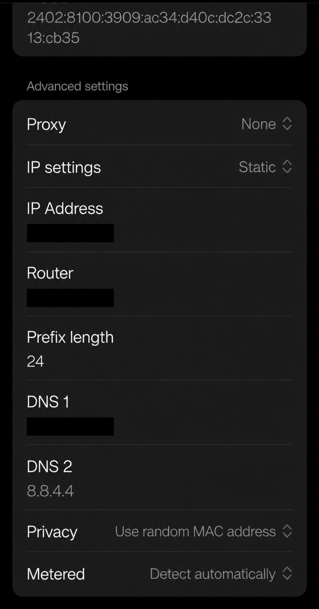
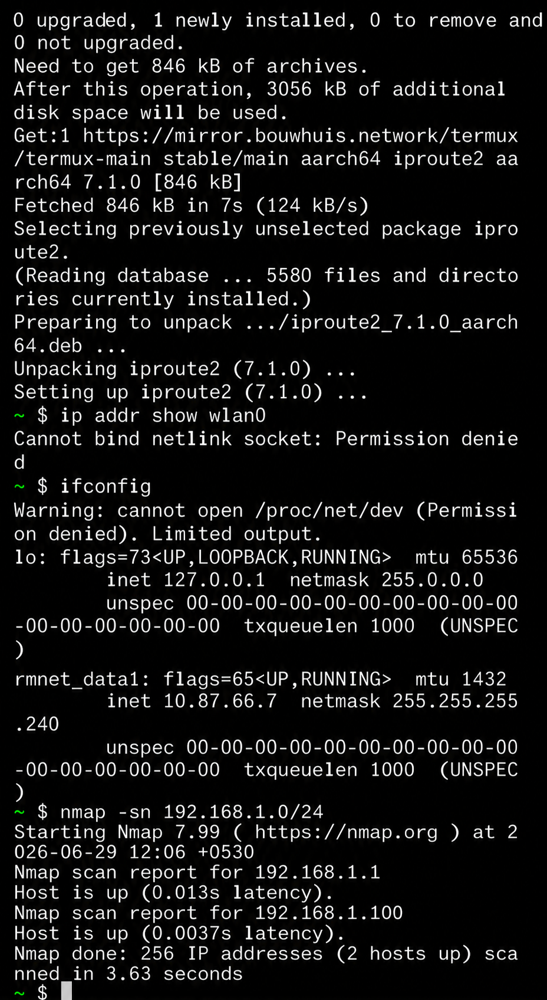
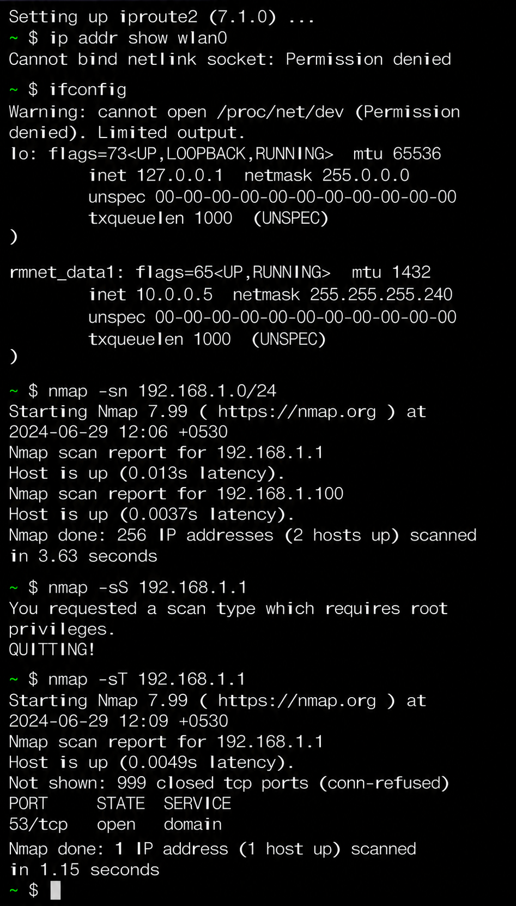
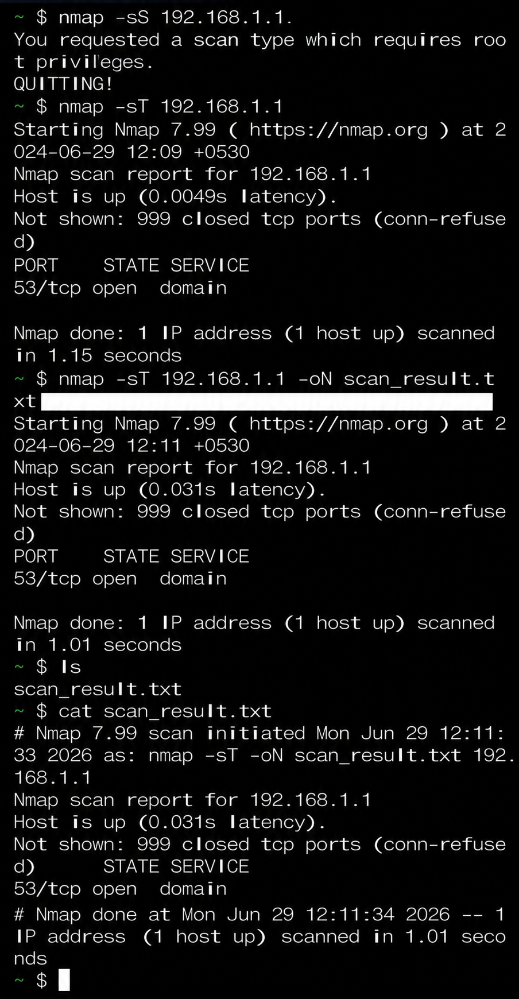

# Task 1: Scan Your Local Network for Open Ports

## Objective

To discover open ports on devices in the local network and understand network exposure using Nmap.

## Tools Used

- Termux
- Nmap
- Android Smartphone

## Network Information

Network Range: 192.168.1.0/24

## Commands Used

### Host Discovery

```bash
nmap -sn 192.168.1.0/24
```

### TCP Connect Scan

```bash
nmap -sT 192.168.1.1
```

### Save Results

```bash
nmap -sT 192.168.1.1 -oN scan_result.txt
```

## Scan Results

### Active Hosts

| IP Address | Status |
|------------|--------|
| 192.168.1.1 | Up |
| 192.168.1.100 | Up |

### Open Ports Found

| Port | Protocol | Service |
|------|----------|---------|
| 53 | TCP | DNS |

## Security Analysis

- Port 53 was found open.
- Port 53 is used for DNS services.
- Exposed DNS services should be monitored and properly secured.
- No other open TCP ports were detected.

## Conclusion

The scan successfully identified active hosts and open ports using Nmap.
## Screenshots

### Network Information


### Host Discovery


### Port Scan


### Saved Scan Result

